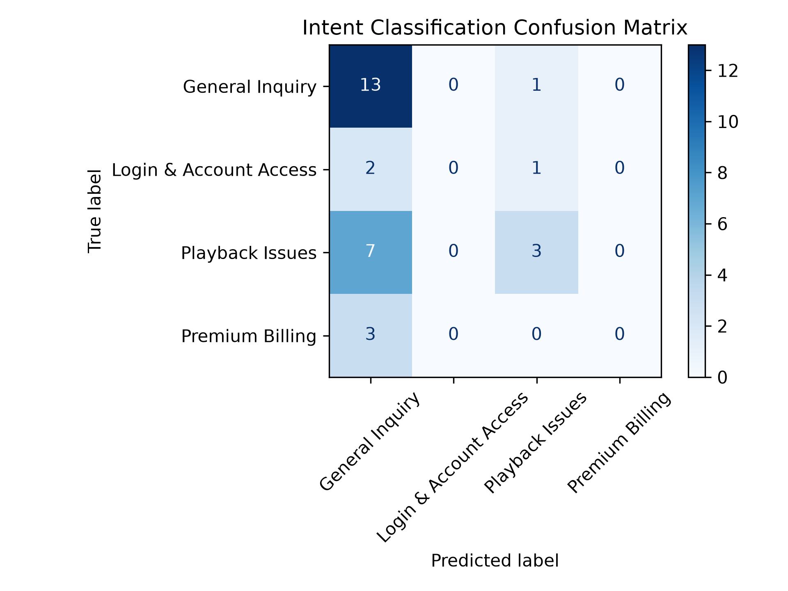

# 🎧 Spotify AI Support Agent

An end-to-end Natural Language Processing (NLP) project that classifies Spotify customer support tweets into support intents using **TF-IDF** and **Logistic Regression**.

## 🚀 Features

* Cleaned and preprocessed real Spotify support tweets
* Manually annotated 50 customer support tweets
* Built a TF-IDF text vectorization pipeline
* Trained a Logistic Regression intent classifier
* Evaluated the model using Precision, Recall, F1-score & Confusion Matrix
* Exported the trained model for future inference

## 🛠️ Tech Stack

* Python
* Pandas
* Scikit-learn
* TF-IDF Vectorizer
* Logistic Regression
* Matplotlib
* Joblib
* Jupyter Notebook

## 📁 Project Structure

```text
hiver-ai-support-agent/
│
├── data/
│   ├── raw/
│   │   └── twcs.csv
│   └── golden_set.csv
│
├── notebooks/
│   ├── 01_exploration.ipynb
│   ├── 02_golden_dataset.ipynb
│   └── 03_train_model.ipynb
│
├── results/
│   ├── confusion_matrix.png
│   └── intent_model.pkl
│
├── requirements.txt
├── README.md
└── .gitignore
```

## 📊 Model Performance

| Metric           |               Value |
| ---------------- | ------------------: |
| Algorithm        | Logistic Regression |
| Vectorizer       |              TF-IDF |
| Training Samples |           50 Tweets |
| Intent Classes   |                   3 |
| Accuracy         |          **36.36%** |

### Confusion Matrix



## 🔮 Future Improvements

* Expand the labeled dataset to 500+ tweets
* Add additional customer support intent categories
* Experiment with transformer models (BERT/DistilBERT)
* Deploy the classifier as a Streamlit web application

## 👩‍💻 Author

**Anjali Moka**

Built as an NLP portfolio project for customer support intent classification.
